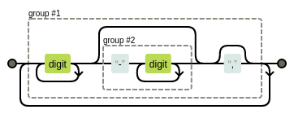
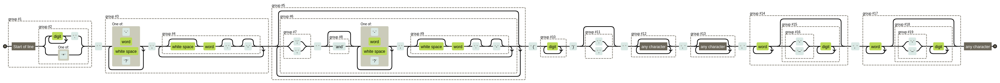

= Code Snippets

Some minor code snippets that I find useful and might be helpful for others too.

== Gnuplot

.Gnuplot 5.2 input line to plot the first ten excited states from an ORCA 5.0.3 TDDFT-Scan for a multi XYZ file
[source]
--
nStates=10
gnuplot> plot for [i=0:nStates-1] "< grep 'STATE.*:' s2.out" every nStates::i using 4 with lp title sprintf("S_{%i}", i+1)
--

image::images/gnuplot_of_scan.png[]

== VIM

.Finding all references from a text document written as [1], [1-2], [1,2-3], [1-2,3] and so on and copies them into t
[source]
--
:let t=[] | %s/\[\(\d\+\(-\d\+\)\?,\?\)\+\]/\=add(t,submatch(1))[1:0]/g
--

When the document has been searched, the contents of `t` can be printed with `:pu=t`

---

.Replacing the multiplicity in Johannes' sing_exc or trip_exc using VIM to whatever mult you want - in this case 3 for triplet
[source]
--
:%s/Excited State \([0-9]\+\) [0-9]\+ \(.*\)/Excited State \1 3 \2/g
--

== Gaussian

=== Errors that tell nothing clear

I encountered the error `Internal consistency failure #1 in ROv06.`
This error means that there is a problem with the Overlay 6 from the IOps: https://gaussian.com/overlay6/
By looking at what is handled by overlay 6, it is clear that the error has something to do with my population analysis keyword.
In my case, it was the combination of nboread and npa together as `pop=(nobread,npa)` which does not work.
`nboread` means that all keywords are redirected to the `$NBO $END` section beneath the coordinates, where `NPA` would be placed then.

=== Reading the output

When checking the frequency calculation for the first normal mode, search for `normal co`.
When checking for excited states, search for `Excited State` and you will find the first.

== Adding weights to the TD-DFT output

.Taking a TD-DFT output file from Gaussian, vertical.log, and use awk to add weights to the MO pairs that are above 8% weight (`2*$4*$4 >= 0.08`) for a closed shell calculation
[source]
--
grep 'Excited State\|->\|<-' vertical.log | sed 's/://g' |awk '{if ($1 != "Excited" && 2*$4*$4 >= 0.08) print $1," -> ",$3,"   ", 200*$4*$4; else if ($1 == "Excited") print $0}'
--

.The same as above but specifying hole orbitals to be MO Nr 205 to 207 and electron orbitals to be (210, 211, 213--215) to find specific excitations
[source]
--
grep 'Excited State\|->\|<-' vertical.log | sed 's/://g' |awk '{if ($1 != "Excited" && 2*$4*$4 >= 0.08 && ($1 == 205 || $1 == 206 || $1 == 207) && ($3 == 210 || $3 == 211 || $3 == 213 || $3 == 214 || $3 == 215)) print $1, $2, $3, "   ", 200*$4*$4; else if ($1 == "Excited") print $0}'
--

=== What are all the L*.exe that Gaussian calls during its execution?

Gaussian is often called a "suite of programs" because it is not a single executable file but consists of many executables, that work together. These executables are called "Links" and can be found on the Gaussian website. To not have to search them on their website, because I think they are a bit hidden, I list them here too.

[%collapsible]
====
[horizontal]
0:: Initializes program and controls overlaying
1:: Processes route section, builds list of links to execute, and initializes scratch files
101:: Reads title and molecule specification
102:: Fletcher-Powell optimizations
103:: Berny optimizations to minima and TS, STQN transition state searches
105:: Murtaugh-Sargent optimizations
106:: Numerical differentiation of forces/dipoles to obtain polarizability/ hyperpolarizability
107:: Linear-synchronous-transit (LST) transition state search
108:: Unrelaxed potential energy surface scan
109:: Newton-Raphson optimization
110:: Double numerical differentiation of energies to produce frequencies
111:: Double numerical differentiation of energies to compute polarizabilities and hyperpolarizabilities
112:: Performs the Self-Consistent Virial Scaling method (SCVS), T. A. Keith's extension of [Lowdin59, Magnoli82, Lehd91]
113:: EF optimization using analytic gradients
114:: EF numerical optimization (using only energies)
115:: Follows reaction path using GS3 algorithm
116:: Numerical self-consistent reaction field (SCRF)
117:: Performs IPCM solvation calculations.
118:: BOMD calculations
120:: Controls ONIOM calculations
121:: ADMP calculations
122:: Counterpoise calculations
123:: Follows reaction path using the HPC algorithm (and others)
124:: Performs ONIOM with PCM and external-iteration PCM
202:: Reorients coordinates, calculates symmetry, and checks variables
301:: Generates basis set information
302:: Calculates overlap, kinetic, and potential integrals
303:: Calculates multipole integrals
308:: Computes dipole velocity and Rx∇ integrals
310:: Computes spdf 2-electron integrals in a primitive fashion
311:: Computes sp 2-electron integrals
314:: Computes spdf 2-electron integrals
316:: Prints 2-electron integrals
319:: Computes 1-electron integrals for approximate spin orbital coupling
401:: Forms the initial MO guess
402:: Performs semi-empirical and molecular mechanics calculations
405:: Initializes an MCSCF calculation
502:: Iteratively solves the SCF equations (conven. UHF & ROHF, all direct methods, SCRF)
503:: Iteratively solves the SCF equations using direct minimization
506:: Performs an ROHF or GVB-PP calculation
508:: Quadratically convergent SCF program
510:: MC-SCF
601:: Population and related analyses (including multipole moments)
602:: 1-electron properties (potential, field, and field gradient)
604:: Evaluates MOs or density over a grid of points
607:: Performs NBO analyses
608:: Non-iterative DFT energies
609:: Atoms in Molecules properties
610:: Numerical integration (for testing integral codes)
701:: 1-electron integral first or second derivatives
702:: 2-electron integral first or second derivatives (sp)
703:: 2-electron integral first or second derivatives (spdf)
716:: Processes information for optimizations and frequencies
801:: Initializes transformation of 2-electron integrals
802:: Performs integral transformation (N3 in-core)
804:: Integral transformation
811:: Transforms integral derivatives & computes their contributions to MP2 2nd derivatives
901:: Anti-symmetrizes 2-electron integrals
902:: Determines the stability of the Hartree-Fock wavefunction
903:: Old in-core MP2
904:: Complete basis set (CBS) extrapolation method of Petersson, et. al.
905:: Complex MP2
906:: Semi-direct MP2
908:: Electron Propagator Program
909:: ADC(3) and related electron propagator models
913:: Calculates post-SCF energies and gradient terms
914:: CI-Singles, RPA and ZIndo excited states; SCF stability
915:: Computes fifth order quantities (for MP5, QCISD(TQ) and BD(TQ))
916:: Old MP4 and CCSD
918:: Reoptimizes the wavefunction
923:: SAC-CI program
925:: Implements the Excited State Electron Transfer (EET) model
1002:: Iteratively solves the CPHF equations; computes various properties (including NMR)
1003:: Iteratively solves the CP-MCSCF equations
1014:: Computes analytic CI-Singles second derivatives
1101:: Computes 1-electron integral derivatives
1102:: Computes dipole derivative integrals
1110:: 2-electron integral derivative contribution to F(x)
1111:: 2 particle density matrix and post-SCF derivatives
1112:: MP2 second derivatives
9999:: Finalizes calculation and output
====

== Regular Expressions

I am using regular expressions a lot, when extracting or modifying existing data.
As a regex can look very confusing, it helps to visualize it.
It can be done easily using https://regexper.com where you just have to enter your regex and get a nice ouput on what it is doing.

https://regexper.com/#%28%5Cd%2B%28-%5Cd%2B%29%3F%2C%3F%29%2B[Let's take the example] from searching for the reference indexes in VIM from above.
There I searched for `(\d+(-\d+)?,?)+` which produces the following graph:

Using the website https://regex101.com one can also test the expressions directly and one gets a nice literal description of what one is doing. For the example above, you can have a look here: https://regex101.com/r/BIgwCO/1 .

Another, more complex example, would be the following expression `(^(\d+\.|[*])) ([-\w\s?]+,(\s?\w\.?-?)+)(((;|,) (and)?[-\w\s?]+,(\s?\w\.?-?)+)*) \((\d+)\)(\.|,)? (.*), (.*), (\w+((-|–)\d+)?), (\w+((-|–)\d+)?).`

If I remember correctly, this regex is extracting the references as produced by, e.g., JACS.

=== Finding Overfull and Underfull warnings

[source]
--
(Overfull|Underfull)((.\r?\n?)?)+\[\]
--

== Miscelaneous

.Finding all different bibtex entry types of a bib file using grep et al.
[source]
--
grep "^@" bibliography2022.bib | tr '{' ' ' | sort | awk '{print $1}' | uniq
--
